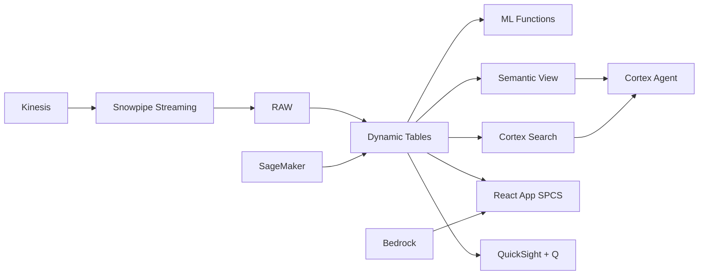

# Last-Mile Logistics Optimization

Route optimization and delivery intelligence for Indonesia's archipelago logistics challenge — ML.FORECAST predicts delivery volumes, Dynamic Tables build real-time fleet dashboards, and Cortex AI generates route recommendations.

## Architecture

Indonesia's 17,000-island archipelago creates the world's most complex last-mile logistics challenge. With 30 million monthly deliveries, on-time rates below target, and Harbolnas (12.12) projected to spike volumes 60%, the VP Logistics needs real-time fleet visibility and ML-powered demand planning — not reactive spreadsheet management after SLA breaches.



## Snowflake Capabilities

| Capability | Implementation |
|-----------|---------------|
| Dynamic Tables | DELIVERY_PERFORMANCE / HUB_CAPACITY / ROUTE_EFFICIENCY / DRIVER_PRODUCTIVITY |
| ML Functions | ML.FORECAST |
| Cortex AI | COMPLETE, AI_CLASSIFY, SUMMARIZE |
| Cortex Search | 80 documents indexed |
| Cortex Agent | LOGISTICS_INTELLIGENCE_AGENT |
| Semantic View | LOGISTICS_ANALYTICS |
| React App (SPCS) | 5 tabs + DemoGuide |


## AWS Services

| Service | Role in Demo |
|---------|-------------|
| Amazon Kinesis | Stream real-time delivery tracking and fleet GPS data |
| Amazon Location Service | Route planning and geospatial fleet optimization |
| AWS Glue | ETL for delivery and fleet data integration |
| Amazon SageMaker | Volume forecasting and route optimization ML models |
| Amazon Bedrock (Claude) | Generate logistics recommendations and surge plans |
| Amazon QuickSight + Q | Logistics operations dashboard with natural language |


## Personas

| Persona | Role | Key Questions |
|---------|------|---------------|
| **Rudi Hartanto** | VP Logistics Operations | "What's our on-time delivery rate this week?" "Which hubs are over capacity?" |
| **Devi Anggraeni** | Network Planning Analyst | "Which routes have the highest cost per delivery?" "Show me the volume forecast for Harbolnas week." |


## Data

| Table | Rows | Description |
|-------|------|-------------|
| DELIVERIES | 30,000,000 | 12 months of parcel delivery records with timestamps, routes, and outcomes |
| HUBS | 500 | Distribution hubs and sortation centers with capacity and throughput |
| FLEET | 15,000 | Delivery fleet (motorcycles, vans, trucks) with location and status |
| ROUTES | 50,000 | Delivery route definitions with distance, time, and cost per segment |
| DRIVER_PERFORMANCE | 200,000 | Driver productivity metrics: deliveries per shift, completion rate, ratings |
| LOGISTICS_DOCS | 80 | SOP documents, route planning guides, and inter-island logistics protocols |


## Build Instructions

### Prerequisites
- Snowflake account with ACCOUNTADMIN access
- Cortex AI enabled (ML Functions, Search, Agent)
- Warehouse: LOGISTICS_WH (Medium)
- AWS CLI with access (us-west-2)

### Deployment

```bash
snowsql -f snowflake/00_setup.sql
snowsql -f snowflake/01_marketplace_install.sql
snowsql -f snowflake/02_raw_tables.sql
snowsql -f snowflake/03_staging.sql
snowsql -f snowflake/04_dynamic_tables.sql
snowsql -f snowflake/05_search.sql
snowsql -f snowflake/06_ml_models.sql
snowsql -f snowflake/07_semantic_view.sql
snowsql -f snowflake/08_agent.sql
```

### React App (SPCS)
```bash
cd app && npm ci && npm run build
docker build -t aws-indonesia-digital-economy-logistics-app .
docker push bdiqc8sm-default.registry.snowflakecomputing.com/logistics_optimization/app/aws_indonesia_digital_economy_logistics/app:latest
```

### Demo Mode
Open the app URL with `?demo=true` for presenter view.

## Build Modes

### Snowflake Only
Run scripts 00-08 (skip AWS-specific integration). Uses:
- **Snowpipe Streaming SDK** instead of Amazon Kinesis
- **Snowflake GEOGRAPHY + Dynamic Tables** instead of Amazon Location Service
- **Dynamic Tables** instead of AWS Glue
- **ML.FORECAST** instead of Amazon SageMaker
- **Cortex Complete** instead of Amazon Bedrock (Claude)
- **Snowflake Intelligence (Cortex Analyst)** instead of Amazon QuickSight + Q

### Full AWS + Snowflake
Run all scripts including AWS integration. Deploy QuickSight dashboard from `quicksight/`.

## Business Impact

Industry research and Snowflake customer outcomes:
- **Indonesia logistics costs represent 23% of GDP — highest in ASEAN** — [World Bank Logistics](https://www.worldbank.org/en/country/indonesia)
- **Indonesian e-commerce logistics market valued at US$8.5B in 2023 with 25% CAGR** — [Ken Research](https://www.kenresearch.com/)
- **AI-optimized routing reduces last-mile delivery costs by 15-25%** — [McKinsey Last-Mile](https://www.mckinsey.com/industries/travel-logistics-and-infrastructure/our-insights)
- **On-time delivery improvement from 91% to 95% reduces customer churn by 20%** — [Bain & Company](https://www.bain.com/)
- **Indeed** (Snowflake customer): processes 25M+ daily orders on Snowflake with ML-powered delivery optimization and marketplace analytics -- [snowflake.com/customers/indeed](https://www.snowflake.com/en/customers/all-customers/case-study/indeed/)

## Key Demo Numbers

- **30M deliveries/month** across 500 hubs and 17,000 islands
- **91.3% OTD** on-time delivery rate (target: 95%)
- **Rp 8,200** average cost per parcel
- **15,000 vehicles** motorcycles, vans, and trucks in fleet
- **50,000 routes** analyzed for optimization opportunities


## License

Apache 2.0 — See [LICENSE](LICENSE) for details.

This is a personal demo project and is not an official Snowflake offering. It comes with no support or warranty.